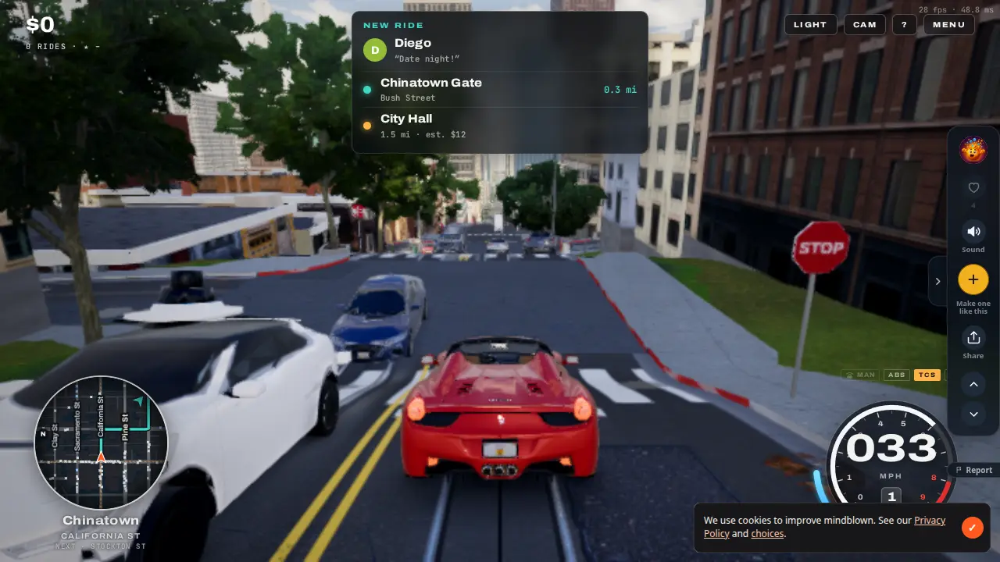
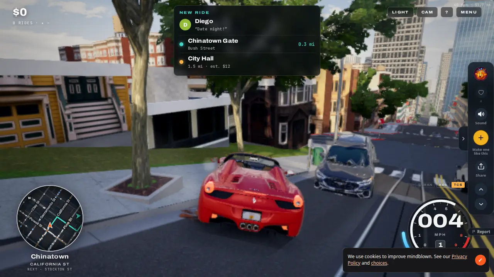

# Teleoperator: techniques banked (2026-10-10)

**Kabe, 2026-10-10:** shared https://mindblown.ai/games/teleoperator ("Nice looking threejs game another claude code made"), then: "I particularly want you to bank elements that make for elegant and efficient visual quality and efficient loading. Lets ingest the best techniques in its architecture."

**My reading:**
- This is a bank of techniques, not a port.
- The game code carries no licence, so we take ideas and write our own code.
- Each technique below says which roadmap item it serves.
- Nothing new is placed on the roadmap; anything that would need a new item goes to Kabe first.

**What it is:**
- A robotaxi game set in real San Francisco: 54,000 buildings, 308,000 props, 103,000 yard plants and 61,000 far trees.
- three.js r186 is its scene graph, and three's WebGL renderer is the fallback. A hand-written WebGPU renderer draws every frame, and its shaders keep their comments.
- Three readers worked through the beautified bundle (100k lines), the site's boot script and workers, and one recorded load. Their full studies, with line evidence:
  - [loading.md](loading.md): how it loads;
  - [look.md](look.md): how it looks good cheaply;
  - [runtime.md](runtime.md): how it runs fast.

**What to admire and what not:**
- **What to admire:**
  - It *feels* fast: something good to look at within about 1 s.
  - Its shaders get a lot of look for few milliseconds.
- **What not to admire:**
  - Its real load: 38 s to ready and 84 MB, with the whole city rebuilt on every visit.
  - Its frame: 30–50 ms at street level here, spent on TAA, screen-space reflections, GTAO, soft shadows and cloud volumes.
- We take the perception, the pacing and the shader tricks, not the passes or the data volume.

## Loading (R65 the manor loads fast)

In order of value:

1. **The first screen is a still of the game itself.** An 80×45 thumbnail inlined in the CSS paints at once; the full 272 KB still sharpens over it, and a slow CSS drift keeps it moving while JavaScript blocks for seconds. The "live city" in our screenshots at 3, 8 and 15 s was this still. Its progress bar glides, because each stage sets its own transition time.
   - **For us:** render the start room as a still when the house is authored, show it the same way, and fade it out when the room is walkable. This ends our frozen 5 s loading screen without touching the build. **Adopt.**
2. **A tiny first script starts the slow work at time zero.** A 13 KB classic script runs before the 2.8 MB main bundle: it requests the GPU device (its comment: about 0.7 s saved), starts the worker pool and begins every data fetch; the main code then picks up the requests already in flight.
   - **For us:** start the device, the texture-painting workers and the fetch of a stored house before our modules arrive. **Adapt**, with the bundling already in R65.
3. **A compact binary container.** A header length, a JSON header naming each array, then raw arrays, read in place with no copying. It is gzipped and unpacked off the main thread, with numbers stored compactly (centimetres in 16-bit integers, heights in 5 cm steps, row-differenced bytes so gzip finds runs).
   - **For us:** this is the format for keeping the built house between visits. Store each merged bundle under the generator's hash plus the seed, in the browser's cache. Compact positions and normals only if a pixel comparison shows no change. **Adopt** (held until after R59).
4. **The build runs to a time limit, nearest first.** Each step can pause and resume; the runner stops at a time limit and lets a frame paint before going on. Slices are about 100 ms during load and 2.5–5 ms a frame in play, and what lies ahead in the direction of travel counts as nearer. For example, 0.8 s of work was spread over 3.8 s with no slow frame.
   - **For us:** build per room, the start room first, then the rest in short slices of 2–4 ms a frame. Each room must depend only on its own seed, never on build order (the determinism spec checks this). **Adapt** (held until after R59).
5. **Shaders compile while the build runs.** Each new material starts its pipeline compiling in the background; at "ready" the wait was 47 ms.
   - **For us:** three.js can't fall back to a generic pipeline, but we can compile a one-mesh scene per unique material as the build makes it: dozens of pipelines rather than the whole scene, which measured 13 s. **Adapt.**
6. **Textures decoded in workers and uploaded as they arrive**, with leftover uploads capped at 3 ms a frame. **Adopt the cap.**
7. **Non-essentials wait on a ladder of timers** set 0.4–2.6 s after ready. **Adopt:** clutter in unseen rooms, the far hillside and portrait faces.
8. **A crash flag.** A "loading" flag is set at start and cleared on success; if it's still set next time, the last load was killed (out of memory on iOS) and the game runs one level lighter. **Adopt** (R50).

## The look (M9, R66–R69)

Ranked by visual gain per millisecond:

1. **Patterns blurred to the pixel's width.** Windows, mortar and bars are repeating bands, each averaged exactly over the pixel's width, so lines thinner than a pixel settle to their average instead of flickering, and random per-window choices fall back to their mean far away. It costs a few shader operations per band and no textures.
   - **For us:** our leaded windows, mouldings, brick and flagstones, without TAA. **Adopt** (R67, R66, R69).
2. **A room behind the glass.** One ray into an imaginary box room per glass pixel, after a small step that sets the glass back into a shaded recess. Fresnel blends in the sky, and at night a share of the rooms are lit, at warm-to-cool colour temperatures.
   - **For us:** seed each box from the window's real room (its size, wall colour, fire or candle), under diamond quarries. It ends the black holes without drawing interiors. **Adapt** (R67).
3. **Baked sky visibility.** Each vertex stores how much open sky it sees, and ambient light is multiplied by a floor plus that share; a multi-bounce correction stops bright surfaces going grey. It costs one multiply per pixel.
   - **For us:** compute it when the house is generated, not as a 10 MB download. With no GTAO this is our occlusion: eaves, wall feet, stair wells and courtyard corners. **Adapt** (R68 beside the probe grid; R69).
4. **Grass in clumps near the camera.** Up to 8,000 instanced clump cards on a jittered 1.6 m grid within 46 m, rebuilt only after the camera moves 10 m. They cast no shadow and fade out between 28 and 44 m; past that, the ground shader paints tufts and dry patches. One draw call.
   - **For us:** it answers the audit's "no grass" directly; weeds at wall feet and wear on paths are placed at generation. **Adopt** (R69).
5. **A sky painted once in a worker**: gradient, sun glow, twilight, streaks and self-shadowed clouds in one texture, repainted only when the hour changes. **Adopt** (R69; it also gives the windows a sky to reflect, R67).
6. **Fog that thins with height**, warm toward the sun and cool away from it. About 20 shader operations and no pass of its own. **Adopt** (grounds and the London street).
7. **Wind in three layers,** trunk, branch and leaf, all from position alone, so shadows and colour agree. **Adopt** for trees, hedges and grass.
8. **Foliage lighting:** a bent normal out of the crown, sun through the leaves when it's behind, and the crown's occlusion in vertex colour. **Adapt** (R69).
9. **Far trees as flat images:** 11 species in 3 views on one 280 KB atlas, crossed quads with faked rounded normals, one draw per chunk. **Adapt** for the estate's woods.
10. **Lighting presets:** five fixed sets (Golden hour, Sunny afternoon, Fog, Blue hour, Rain), each setting the sun, fog, exposure, bloom and grade. **Adopt** as "the hour of the case".
11. **Edges without TAA:** their soft dithered edges rely on TAA. We use alpha-to-coverage under MSAA instead, keeping their fade for cards seen edge-on and their near-camera dissolve. **Adapt.**
12. **One colour-grade pass, and bloom only above white.** **Adapt:** fold the grade into our output pass; bloom on desktop only, for candles and fire.

**Their flaws, to avoid** (see street1 and street2 below):
- **Stretched fronts:** one generated photo is fitted to each lot, and stoops and stairs painted into it shear flat up close. *Keep textures sized in metres, and build relief rather than paint it.*
- **A see-through red-and-teal smear:** most likely dithered transparency that TAA averages into a veil, then a blur toward the frame's edges. (This is read from the code, not confirmed in play.) *No dithered transparency; no edge blurs.*

 

## Runtime (R50 phone fps; M8 people)

1. **People animated in the vertex shader.** Each walker's limbs are turned about hip, knee, shoulder and elbow in the shader; phase, cadence and pose ride in the instance matrix's unused row. There are no bones and no animation textures, and the CPU writes one matrix per person.
   - **For us:** this is R61's "movement made in code from age and build". For MakeHuman's single mesh, give each vertex its main joint and about 12 joint turns from per-person data. **Adapt**, then measure against baked animation textures in R60's 300-person phone test.
2. **Shadows split by what moves.** The static sun map is redrawn only when its key changes; a small map for cars and people is drawn every frame; the light snaps to whole shadow texels. **Adapt:** we already draw a still sun once; add the movers map so walking people don't redraw the house's (R64).
3. **Automatic quality tiers.**
   - A 3.5 s test after 90 warm frames picks a tier.
   - Before resolution drops, effects are shed in order.
   - GPU time is read every 16th frame, so a frame limited by the CPU never lowers resolution.
   - Six slow seconds in a row step the tier down.
   - **Adapt** (R50). Our controller only steps resolution.
4. **Phone tier from the GPU's name** (Adreno, Mali, PowerVR, or Apple with touch, under 8 GB). It catches tablets with phone GPUs, which our touch-and-screen-size test misses. **Adopt** (R50).
5. **Instance pools by distance, grouped by cell.**
   - One instanced mesh per cell and kind, shown or hidden as a whole.
   - Fixed near and mid pools.
   - Anything hidden gets a zero-size matrix.
   - **Adapt:** this may be enough without InstancedMesh2. Test both in R60.
6. **A flat 2D collision grid** (24 m cells) holding 342,000 colliders, with parked cars asleep until hit. **Adopt** when crowds need avoidance (R62, R64).
7. **An id hidden in a vertex coordinate's lowest bits,** so the shader can spin a wheel. **Adapt** for doors, shutters and inn signs.

**Not worth taking:**
- its re-recorded render bundles: three's `BundleGroup` already covers our static meshes;
- its expensive post passes;
- its 10 MB baked sky file;
- rebuilding on every visit.

## What comes first

**R65, in this order:**
1. The still title (no change to the build; ready to do now).
2. The boot script with bundling.
3. The stored built house.
4. The room-first build in slices. Steps 3 and 4 are held until after Kabe's R59 walk-through, per his monitor.

**R50:**
- the crash flag;
- the phone tier from the GPU's name;
- the effects-shedding ladder.

**M8 and M9:** each technique is noted above against its item, to pick up when that item starts.
